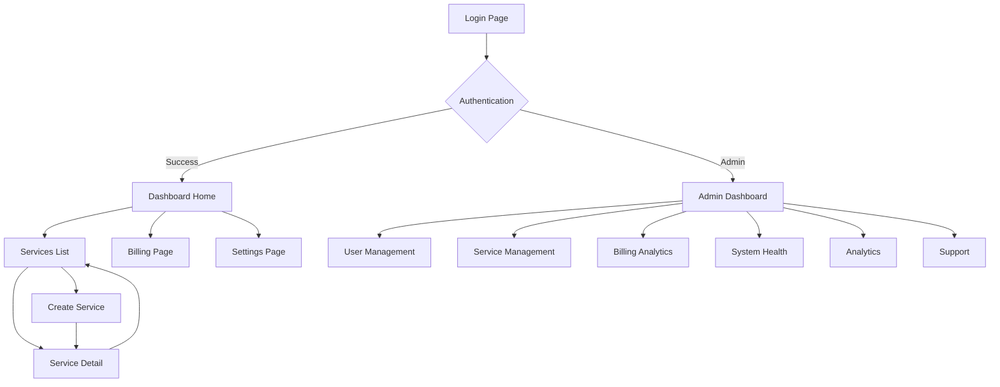

## 1. Product Overview
QuickSpin is a managed microservices platform that provides Redis, RabbitMQ, Elasticsearch, and other services through a shared Kubernetes architecture. The frontend application serves as the primary interface for developers and teams to manage their microservices infrastructure with ease.

The platform solves the complexity of managing distributed services by providing a unified dashboard for service provisioning, monitoring, billing, and administration. Developers can quickly spin up services, monitor performance, and manage costs through an intuitive interface.

## 2. Core Features

### 2.1 User Roles
| Role | Registration Method | Core Permissions |
|------|---------------------|------------------|
| Regular User | Email registration, OAuth (GitHub, Google) | Create/manage services, view billing, access dashboard |
| Admin User | Invitation-based upgrade | Full platform access, user management, system monitoring |

### 2.2 Feature Module
Our QuickSpin platform requirements consist of the following main pages:

1. **Authentication Pages**: Sign up, Login, Password Reset
2. **User Dashboard**: Home, Services List, Create Service Wizard, Service Detail, Billing, Settings
3. **Admin Panel**: Dashboard, User Management, Service Management, Billing Analytics, System Health, Analytics, Support

### 2.3 Page Details
| Page Name | Module Name | Feature description |
|-----------|-------------|---------------------|
| Sign Up | Registration Form | Email/password registration with validation, OAuth integration (GitHub, Google), password strength indicator, terms acceptance |
| Login | Authentication Form | Email/password login, OAuth buttons, forgot password link, remember me functionality |
| Password Reset | Reset Flow | Email input for reset, confirmation screen, new password creation |
| Dashboard Home | Overview Section | Welcome message, quick stats cards (active services, usage hours, current spend), recent activity feed, quick actions |
| Dashboard Home | Usage Analytics | 30-day usage graph with time-series data, service status indicators with real-time updates |
| Services List | Service Grid | Tabbed view by service type, service cards with editable names, status badges, region info, quick actions |
| Services List | Search & Filter | Real-time search functionality, filter by service type, status, region |
| Create Service Wizard | Multi-step Form | 5-step process: service selection, configuration, region choice, naming, review with real-time pricing |
| Service Detail | Overview Tab | Connection details with copy buttons, code snippets for multiple languages, service health status |
| Service Detail | Metrics Tab | Time-series charts (CPU, Memory, Network I/O, Requests/sec), time range selector, export functionality |
| Service Detail | Logs Tab | Real-time log streaming, level filtering, search functionality, download logs |
| Service Detail | Settings Tab | Service renaming, configuration upgrades, danger zone actions (restart, stop, delete) |
| Billing | Usage Summary | Current month summary, usage breakdown by service with pie chart, billing history table |
| Billing | Payment Management | Payment methods management, add new payment method, invoice downloads, usage alerts |
| Settings | Profile Tab | Avatar upload, name/email updates with verification, password changes, account deletion |
| Settings | Organization Tab | Organization management, team member invitations, role assignments |
| Settings | API Keys Tab | API key creation and management, key revocation, scope configuration |
| Settings | Preferences Tab | Theme toggle, email notifications, timezone selection |
| Admin Dashboard | System Overview | Platform metrics (users, services, revenue, error rates), real-time health status |
| Admin User Management | User Table | Searchable/sortable user list with pagination, user detail modal, bulk actions |
| Admin Service Management | Service Overview | All services across users, filtering and bulk operations, service detail modal |
| Admin Billing Analytics | Revenue Analytics | MRR/ARR charts, plan breakdown, top spenders, payment tracking |
| Admin System Health | Infrastructure Monitoring | Kubernetes cluster metrics, node status, service operator health |
| Admin Analytics | Platform Analytics | User growth, service trends, regional distribution, churn analysis |
| Admin Support | Ticket Management | Support ticket queue, detail views, internal notes, canned responses |

## 3. Core Process

### Regular User Flow
1. User lands on login page → Authenticates via email/OAuth → Redirects to dashboard
2. From dashboard: View overview → Navigate to services → Create new service → Configure and deploy
3. Service management: Monitor metrics → View logs → Adjust settings → Manage billing
4. Account management: Update profile → Configure settings → Manage API keys

### Admin User Flow
1. Admin login → Access admin dashboard → View system overview
2. User management: Search/filter users → View user details → Perform administrative actions
3. Service oversight: Monitor all services → Bulk operations → System health monitoring
4. Analytics: View revenue data → Analyze trends → Generate reports

## 4. User Interface Design

### 4.1 Design Style
- **Primary Colors**: Purple-violet gradient (#667eea → #764ba2)
- **Dark Mode**: True black (#000000) with subtle gray accents (#1a1a1a, #2a2a2a)
- **Light Mode**: White (#ffffff) with light gray backgrounds (#f8f9fa, #e9ecef)
- **Accent Colors**: Success green (#10b981), Warning amber (#f59e0b), Error red (#ef4444), Info blue (#3b82f6)
- **Typography**: Modern sans-serif fonts, responsive sizing (14px-18px body text)
- **Button Style**: Rounded corners (8px radius), subtle shadows, hover animations
- **Layout**: Card-based design with consistent spacing (8px grid system)
- **Icons**: Lucide React icon library with consistent stroke width
- **Animations**: Framer Motion for smooth transitions, spinning logo for loading states

### 4.2 Page Design Overview
| Page Name | Module Name | UI Elements |
|-----------|-------------|-------------|
| Login/Sign Up | Auth Forms | Centered card layout, gradient background, OAuth buttons with brand colors, form validation messages |
| Dashboard Home | Stats Cards | Grid layout with gradient backgrounds, animated number counters, sparkline charts |
| Services List | Service Grid | Responsive card grid, status badges with color coding, hover effects, action dropdowns |
| Service Detail | Tabs Navigation | Horizontal tab bar with active state indicators, content panels with smooth transitions |
| Create Service | Step Indicator | Progress bar with numbered steps, form sections with clear grouping |
| Billing | Charts | Recharts integration with gradient fills, interactive tooltips, responsive sizing |
| Admin Tables | Data Tables | Sortable columns, pagination controls, bulk action toolbar, search input |

### 4.3 Responsiveness
- **Mobile-First Approach**: Base design for mobile devices, enhanced for larger screens
- **Breakpoints**: Mobile (<640px), Tablet (640px-1024px), Desktop (1024px-1280px), Large Desktop (>1280px)
- **Touch Optimization**: Larger tap targets on mobile, swipe gestures for navigation
- **Collapsible Elements**: Sidebar collapses to hamburger menu, tables become cards on mobile

### 4.4 Accessibility
- **WCAG 2.1 AA Compliance**: Color contrast ratios, keyboard navigation, screen reader support
- **Semantic HTML**: Proper heading hierarchy, ARIA labels, landmark regions
- **Keyboard Navigation**: Tab order optimization, skip links, focus indicators
- **Screen Reader Support**: Descriptive alt text, proper form labeling, status announcements