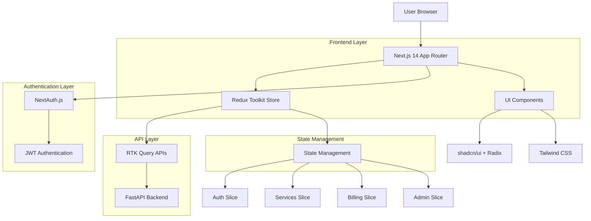
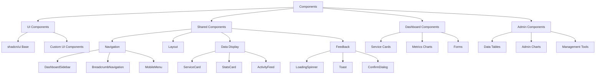

## 1. Architecture Design



## 2. Technology Description

* **Frontend**: Next.js 14+ (App Router) + React 18+ + TypeScript

* **State Management**: Redux Toolkit + RTK Query

* **UI Components**: shadcn/ui (Radix UI primitives) + Lucide React icons

* **Styling**: Tailwind CSS 3+ with custom design system

* **Forms**: React Hook Form + Zod validation

* **Charts**: Recharts for data visualization

* **Authentication**: NextAuth.js with JWT strategy

* **Animation**: Framer Motion for transitions

* **Initialization Tool**: create-next-app

## 3. Route Definitions

| Route                     | Purpose                               | Protection |
| ------------------------- | ------------------------------------- | ---------- |
| /                         | Landing page with product information | Public     |
| /login                    | User authentication page              | Public     |
| /signup                   | User registration page                | Public     |
| /reset-password           | Password reset flow                   | Public     |
| /dashboard                | Main dashboard overview               | Protected  |
| /dashboard/services       | Services list and management          | Protected  |
| /dashboard/services/new   | Create new service wizard             | Protected  |
| /dashboard/services/\[id] | Individual service details            | Protected  |
| /dashboard/billing        | Billing and usage information         | Protected  |
| /dashboard/settings       | User settings and preferences         | Protected  |
| /admin                    | Admin dashboard overview              | Admin only |
| /admin/users              | User management interface             | Admin only |
| /admin/services           | All services management               | Admin only |
| /admin/billing            | Revenue analytics and reports         | Admin only |
| /admin/health             | System health monitoring              | Admin only |
| /admin/analytics          | Platform analytics and insights       | Admin only |
| /admin/support            | Support ticket management             | Admin only |

## 4. API Definitions

### 4.1 Authentication APIs

```typescript
// Login Request
POST /api/auth/login
{
  email: string;
  password: string;
  rememberMe?: boolean;
}

// Login Response
{
  user: {
    id: string;
    email: string;
    name: string;
    avatar?: string;
    role: 'user' | 'admin';
  };
  accessToken: string;
  refreshToken: string;
}

// OAuth Login
POST /api/auth/oauth/{provider}
{
  code: string;
  redirectUri: string;
}
```

### 4.2 Services APIs

```typescript
// Get User Services
GET /api/services
{
  page?: number;
  limit?: number;
  type?: 'redis' | 'rabbitmq' | 'elasticsearch';
  status?: 'running' | 'stopped' | 'error';
  search?: string;
}

// Create Service
POST /api/services
{
  name: string;
  type: 'redis' | 'rabbitmq' | 'elasticsearch';
  configuration: {
    ram: number;
    cpu: number;
    persistence: boolean;
  };
  region: string;
}

// Get Service Details
GET /api/services/{id}
{
  id: string;
  name: string;
  type: string;
  status: string;
  configuration: object;
  connectionDetails: {
    host: string;
    port: number;
    username: string;
    password: string;
  };
  metrics: {
    cpu: TimeSeriesData[];
    memory: TimeSeriesData[];
    network: TimeSeriesData[];
    requests: TimeSeriesData[];
  };
  logs: LogEntry[];
}
```

### 4.3 Billing APIs

```typescript
// Get Billing Summary
GET /api/billing/summary
{
  currentMonth: {
    total: number;
    services: Array<{
      serviceId: string;
      serviceName: string;
      type: string;
      cost: number;
      usage: number;
    }>;
  };
  paymentMethods: PaymentMethod[];
  invoices: Invoice[];
}

// Add Payment Method
POST /api/billing/payment-methods
{
  type: 'card';
  cardDetails: {
    number: string;
    expiry: string;
    cvv: string;
  };
}
```

## 5. Redux Store Structure

```mermaid
graph TD
    A[Redux Store] --> B[Auth Slice]
    A --> C[Services Slice]
    A --> D[Billing Slice]
    A --> E[UI Slice]
    A --> F[Admin Slice]
    
    B --> G[user: User | null]
    B --> H[isAuthenticated: boolean]
    B --> I[loading: boolean]
    B --> J[error: string | null]
    
    C --> K[services: Service[]]
    C --> L[currentService: Service | null]
    C --> M[serviceMetrics: Metrics]
    C --> N[serviceLogs: LogEntry[]]
    
    D --> O[billingSummary: BillingSummary]
    D --> P[paymentMethods: PaymentMethod[]]
    D --> Q[invoices: Invoice[]]
    
    E --> R[theme: 'light' | 'dark']
    E --> S[sidebarCollapsed: boolean]
    E --> T[notifications: Notification[]]
    
    F --> U[allUsers: User[]]
    F --> V[allServices: Service[]]
    F --> W[systemHealth: HealthStatus]
    F --> X[analytics: AnalyticsData]
```

### 5.1 RTK Query API Structure

```typescript
// Base API configuration
export const baseApi = createApi({
  reducerPath: 'api',
  baseQuery: fetchBaseQuery({
    baseUrl: process.env.NEXT_PUBLIC_API_URL,
    prepareHeaders: (headers, { getState }) => {
      const token = (getState() as RootState).auth.accessToken;
      if (token) {
        headers.set('authorization', `Bearer ${token}`);
      }
      return headers;
    },
  }),
  tagTypes: ['Service', 'User', 'Billing', 'Metrics'],
  endpoints: () => ({}),
});

// Services API
export const servicesApi = baseApi.injectEndpoints({
  endpoints: (builder) => ({
    getServices: builder.query<Service[], GetServicesParams>({
      query: (params) => ({
        url: '/services',
        params,
      }),
      providesTags: ['Service'],
    }),
    createService: builder.mutation<Service, CreateServiceData>({
      query: (data) => ({
        url: '/services',
        method: 'POST',
        body: data,
      }),
      invalidatesTags: ['Service'],
    }),
  }),
});
```

## 6. Component Architecture

### 6.1 Shared Components Structure



### 6.2 Key Component Interfaces

```typescript
// Service Card Component
interface ServiceCardProps {
  service: Service;
  onView: (id: string) => void;
  onStop: (id: string) => void;
  onDelete: (id: string) => void;
  loading?: boolean;
}

// Metrics Chart Component
interface MetricsChartProps {
  data: TimeSeriesData[];
  type: 'cpu' | 'memory' | 'network' | 'requests';
  timeRange: '1h' | '24h' | '7d' | '30d';
  height?: number;
}

// Data Table Component
interface DataTableProps<T> {
  data: T[];
  columns: ColumnDef<T>[];
  searchable?: boolean;
  sortable?: boolean;
  pagination?: boolean;
  onRowClick?: (row: T) => void;
}
```

## 7. State Management Patterns

### 7.1 Authentication Flow

```typescript
// Auth slice with NextAuth.js integration
const authSlice = createSlice({
  name: 'auth',
  initialState: {
    user: null,
    isAuthenticated: false,
    loading: false,
    error: null,
  },
  reducers: {
    setCredentials: (state, action) => {
      state.user = action.payload.user;
      state.isAuthenticated = true;
    },
    logout: (state) => {
      state.user = null;
      state.isAuthenticated = false;
    },
  },
  extraReducers: (builder) => {
    builder
      .addCase(login.pending, (state) => {
        state.loading = true;
        state.error = null;
      })
      .addCase(login.fulfilled, (state, action) => {
        state.loading = false;
        state.user = action.payload.user;
        state.isAuthenticated = true;
      })
      .addCase(login.rejected, (state, action) => {
        state.loading = false;
        state.error = action.payload as string;
      });
  },
});
```

### 7.2 Optimistic Updates Pattern

```typescript
// Optimistic update for service actions
const updateServiceStatus = async (serviceId: string, status: string) => {
  // Optimistically update UI
  dispatch(optimisticallyUpdateService({ id: serviceId, status }));
  
  try {
    // Make API call
    await updateService({ id: serviceId, status }).unwrap();
    // Success - cache already updated
  } catch (error) {
    // Revert on error
    dispatch(revertServiceUpdate({ id: serviceId }));
    showErrorToast('Failed to update service status');
  }
};
```

## 8. Performance Optimizations

### 8.1 Code Splitting Strategy

```typescript
// Dynamic imports for heavy components
const MetricsChart = dynamic(() => import('@/components/dashboard/MetricsChart'), {
  loading: () => <ChartSkeleton />,
  ssr: false,
});

const ServiceLogs = dynamic(() => import('@/components/dashboard/ServiceLogs'), {
  loading: () => <LogSkeleton />,
  ssr: false,
});
```

### 8.2 Caching Strategy

```typescript
// RTK Query cache configuration
const baseQuery = fetchBaseQuery({
  baseUrl: process.env.NEXT_PUBLIC_API_URL,
});

// Cache invalidation patterns
export const servicesApi = createApi({
  reducerPath: 'servicesApi',
  baseQuery,
  tagTypes: ['Service', 'Metrics'],
  keepUnusedDataFor: 300, // 5 minutes
  refetchOnMountOrArgChange: 30, // 30 seconds
  endpoints: (builder) => ({
    getServices: builder.query({
      query: () => '/services',
      providesTags: (result) => 
        result ? [
          ...result.map(({ id }) => ({ type: 'Service' as const, id })),
          { type: 'Service', id: 'LIST' },
        ] : [{ type: 'Service', id: 'LIST' }],
    }),
  }),
});
```

## 9. Security Implementation

### 9.1 Authentication Security

```typescript
// NextAuth.js configuration with JWT
export const authOptions: NextAuthOptions = {
  providers: [
    CredentialsProvider({
      name: 'credentials',
      credentials: {
        email: { label: 'Email', type: 'email' },
        password: { label: 'Password', type: 'password' }
      },
      async authorize(credentials) {
        // Server-side validation
        const user = await validateCredentials(credentials);
        return user;
      }
    }),
    GitHubProvider({
      clientId: process.env.GITHUB_ID,
      clientSecret: process.env.GITHUB_SECRET,
    }),
    GoogleProvider({
      clientId: process.env.GOOGLE_ID,
      clientSecret: process.env.GOOGLE_SECRET,
    })
  ],
  session: {
    strategy: 'jwt',
    maxAge: 30 * 24 * 60 * 60, // 30 days
  },
  callbacks: {
    async jwt({ token, user }) {
      if (user) {
        token.id = user.id;
        token.role = user.role;
      }
      return token;
    },
    async session({ session, token }) {
      if (token) {
        session.user.id = token.id;
        session.user.role = token.role;
      }
      return session;
    }
  }
};
```

### 9.2 Route Protection

```typescript
// Middleware for route protection
export async function middleware(request: NextRequest) {
  const token = await getToken({ req: request });
  const isAuthPage = request.nextUrl.pathname.startsWith('/login');
  const isAdminPage = request.nextUrl.pathname.startsWith('/admin');
  
  if (!token && !isAuthPage) {
    return NextResponse.redirect(new URL('/login', request.url));
  }
  
  if (token && isAuthPage) {
    return NextResponse.redirect(new URL('/dashboard', request.url));
  }
  
  if (isAdminPage && token?.role !== 'admin') {
    return NextResponse.redirect(new URL('/dashboard', request.url));
  }
}

export const config = {
  matcher: ['/dashboard/:path*', '/admin/:path*', '/login', '/signup']
};
```

## 10. Error Handling Strategy

### 10.1 Global Error Boundary

```typescript
// Error boundary for graceful error handling
export default function GlobalError({
  error,
  reset,
}: {
  error: Error & { digest?: string };
  reset: () => void;
}) {
  useEffect(() => {
    // Log error to error tracking service
    console.error(error);
  }, [error]);

  return (
    <html>
      <body>
        <div className="flex min-h-screen items-center justify-center">
          <div className="text-center">
            <h2 className="text-2xl font-bold">Something went wrong!</h2>
            <p className="mt-2 text-gray-600">
              We apologize for the inconvenience. Please try again.
            </p>
            <Button onClick={reset} className="mt-4">
              Try again
            </Button>
          </div>
        </div>
      </body>
    </html>
  );
}
```

### 10.2 API Error Handling

```typescript
// Centralized error handling for RTK Query
const baseQueryWithErrorHandling = async (
  args: string | FetchArgs,
  api: BaseQueryApi,
  extraOptions: {}
) => {
  const result = await baseQuery(args, api, extraOptions);
  
  if (result.error) {
    const errorMessage = extractErrorMessage(result.error);
    
    // Show user-friendly error message
    api.dispatch(showToast({
      type: 'error',
      message: errorMessage,
    }));
    
    // Handle specific error codes
    if (result.error.status === 401) {
      api.dispatch(logout());
      redirect('/login');
    }
  }
  
  return result;
};
```

